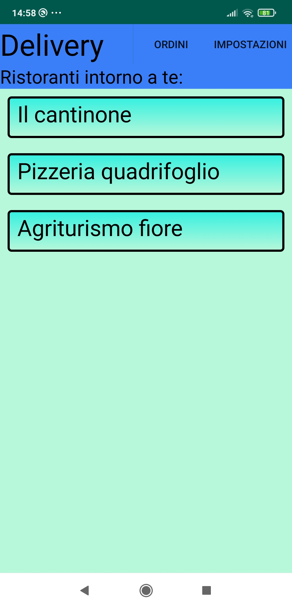
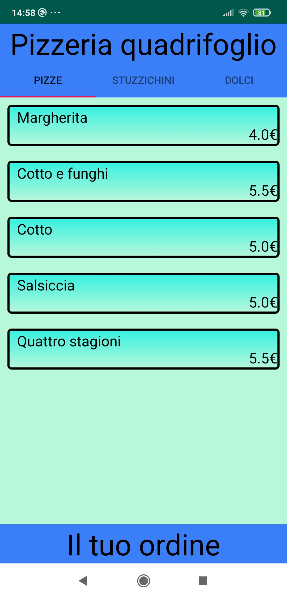
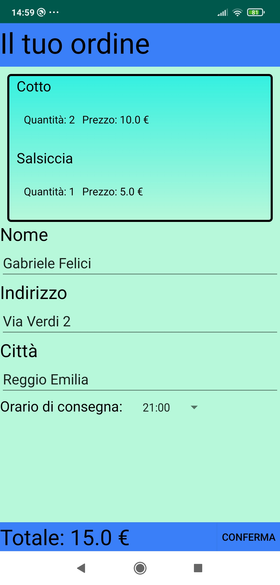

# Progetto di esame per il corso di programmazione mobile
L'applicazione permette ai vari utenti registrati di richiedere consegne a domicilio nei vari ristoranti della zona.
Ogni ristorante mette a dispozione un proprio menù e si può richiedere la consegna a domicilio di vari piatti a scelta.
La gestione dei dati (menu, ristoranti, ordini) e degli utenti è gestita mediante cloud Firestore.
Ogni ristorante è geolocalizzato, ed è possibile fare richieste ai ristoranti nei paraggi a seconda della posizione dell'utente, 
facendo uso di un LocationManager.

## MainActivity

Dopo il login l'applicazione ottiene la posizione dell'utente e fornisce i ristoranti disponibili a consegnare nelle vicinanze.
E' possibile selezionarne uno per richiedere una consegna.

## RestaurantActivity

E' possibile navigare nel menù e richiedere il numero di piatti per ogni voce.
Una volta compilata la propria richiesta si può confermare passando per "Il tuo ordine".

## OrderActivity

Viene visualizzato un riepilogo dell'ordine. Si forniscono alcuni dati anagrafici e l'indirizzo e l'orario di consegna.
Una volta confermato i dati vengono salvati sul cloud Firestore.
